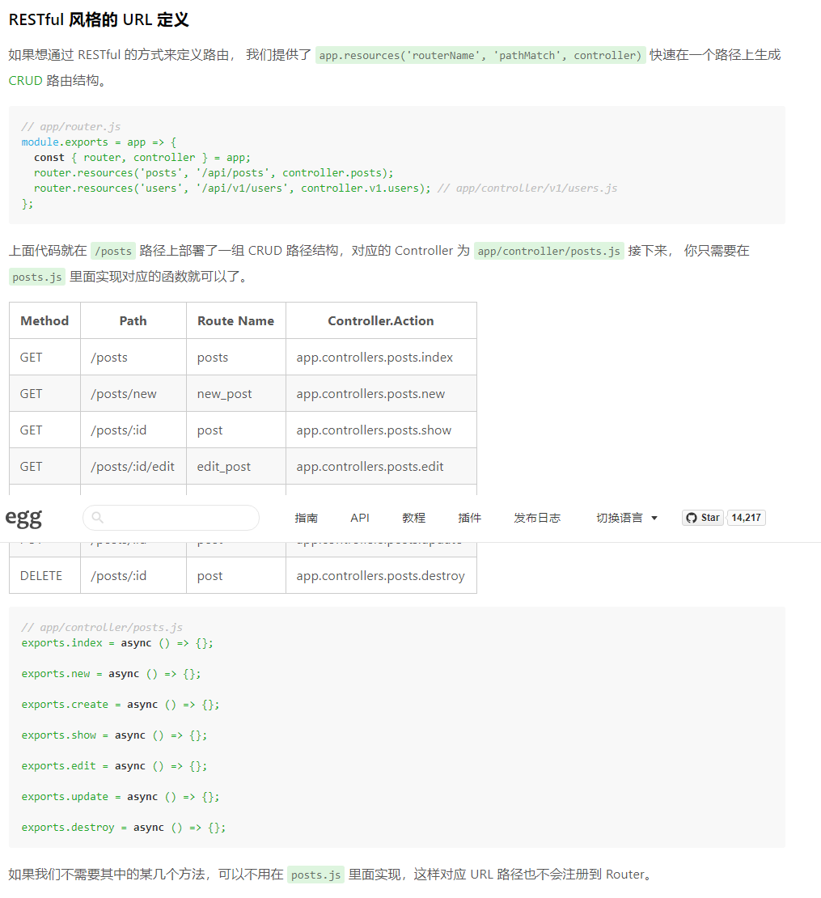

# egg

## egg-sequelize

#### 1、所有表名默认为复数

- 方式一 ： app\model\user.js

```js
	// 定义model
    /**
     * arg1: 表名
     * arg2: model成员属性
     * arg3: model约束
     */
    const User = app.model.define('u_user', {
        login: STRING,
        name: STRING(30),
        password: STRING(32),
        age: INTEGER,
        last_sign_in_at: DATE,
        created_time: DATE,
        updated_time: DATE,
    },{
        // 取消自动维护时间戳，默认对model的时间戳，为created_at, updated_at
        timestamps: false,
        // 禁止修改表名，默认情况， sequelize将自动将所有传递的模型名称转换为复数
        freezeTableName: true
    });
```

- 方式二 ： 直接修改 config/config.[env].js的sequelize配置

```javascript
exports.sequelize = {
    dialect: 'mysql',
    ....
    define: {
      underscored: true, // 注意需要加上这个， egg-sequelize只是简单的使用Object.assign对配置和默认配置做了merge, 如果不加这个 update_at会被转变成 updateAt故报错
      // 禁止修改表名，默认情况下，sequelize将自动将所有传递的模型名称（define的第一个参数）转换为复数
      freezeTableName: true
    }
  }
```

#### 2、时间存储问题

##### 1、mysql保存时会自动保存为UTC格式，此外egg-sequelize在读取时间时，还是会返回UTC格式：

```js
config.sequelize = {
    dialect: 'mysql',
    ....
    timezone: '+08:00' ,// 保存为本地时区
    dialectOptions: {
      dateStrings: true,
      typeCast(field, next) {
        // for reading from database
        if (field.type === "DATETIME") {
          return field.string();
        }
        return next();
      }
    }
  }
```

#### 3、model字段定义

```js
 createAt: {
            type: DATE,
            // 属性对应字段名，类似@TableField
            field: 'created_time',
            allowNull: false,
            defaultValue: NOW,
        },
```

#### 4、sequelize事务

service中

```js
 register = async ({login, name, password})=>{
        const {ctx}  = this;
        let transaction;

        try {
            // 这里需要注意，egg-sequelize会将sequelize实例作为app.model对象
            transaction = await ctx.model.transaction();
		} catch (err) {
            ctx.logger.error(err);
            await transaction.rollback();
        }
    }
```

#### 5、model关联

## RESTFUL



1、router.js

```js
router.resources('user', '/sys/user', controller.sys.user)
```

2、controller/user.js

```js
	/**
     * GET /user
     */
    async index() {

        console.log(this.ctx.model)
        const users = await this.ctx.model.User.findAll();
        this.ctx.body = users;
    }

    /** POST /user/:id */
    async show() {
        const user = await this.ctx.model.User.findByLogin(this.ctx.params.login);
        await user.logSignin();
        this.ctx.body = user;
    }

    /** GET /user/new */
    async new() {
        console.log('GET /user/new ')
    }

    /** GET /user/:id/edit */
    async edit() {
        console.log('GET /user/:id/edit')
    }

    /** POST /user */
    async create() {
        console.log('POST /user')
    }

    /** PUT /user/:id */
    async update() {
        console.log('PUT /user/:id')
    }

    /** DELETE /user/:id */
    async destroy() {
        console.log('DELETE /user/:id')
    }
```


